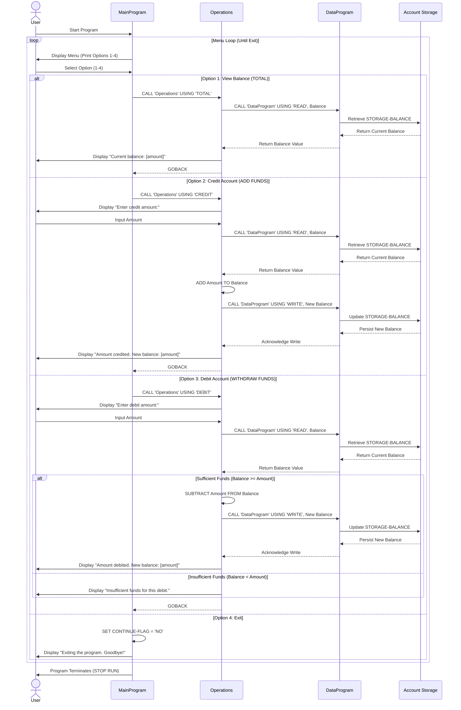

# Student Account Management System - COBOL Documentation

## Overview
The Student Account Management System is a legacy COBOL application designed to manage student account operations including balance inquiries, credit transactions, and debit transactions. This system provides a menu-driven interface for account management with built-in validation to prevent overdrafts.

---

## COBOL File Structure

### 1. `main.cob` - Main Program Entry Point
**Program ID:** `MainProgram`

**Purpose:**
- Serves as the main entry point for the Account Management System
- Provides an interactive menu-based user interface
- Orchestrates program flow based on user selections
- Handles the session lifecycle until the user chooses to exit

**Key Functions:**
- **Main Menu Display**: Shows available options to the user
  - Option 1: View Balance (calls Operations with 'TOTAL' parameter)
  - Option 2: Credit Account (calls Operations with 'CREDIT' parameter)
  - Option 3: Debit Account (calls Operations with 'DEBIT' parameter)
  - Option 4: Exit (terminates the program)
- **Input Validation**: Accepts numeric choices and validates against allowed options
- **Program Flow Control**: Uses a `CONTINUE-FLAG` to maintain the session loop until user exit

**Business Rules:**
- The system runs in a continuous loop until the user explicitly selects exit (option 4)
- Invalid menu choices (outside 1-4 range) display an error message and prompt for re-entry
- Each user action calls the Operations module to perform specific business logic

---

### 2. `data.cob` - Data Management Module
**Program ID:** `DataProgram`

**Purpose:**
- Encapsulates the data storage layer for student account information
- Manages account balance persistence and retrieval
- Provides a consistent interface for reading and writing account data
- Acts as a bridge between business logic and persistent storage

**Key Functions:**
- **READ Operation**: Retrieves the current account balance
  - Parameter: 'READ' operation code
  - Returns: Current balance from `STORAGE-BALANCE`
- **WRITE Operation**: Updates the account balance
  - Parameter: 'WRITE' operation code with new balance value
  - Action: Persists the new balance to `STORAGE-BALANCE`

**Data Definitions:**
- **STORAGE-BALANCE**: `PIC 9(6)V99` - The persistent account balance storage
  - Initial Value: 1000.00 (represents the starting student account credit)
  - Format: 6 digits before decimal, 2 digits after (e.g., 999999.99)
- **OPERATION-TYPE**: `PIC X(6)` - Specifies the operation to perform

**Business Rules:**
- Initial student account balance is set to 1000.00 (system default credit)
- The data module does not enforce business validation; it only manages storage/retrieval
- All balance updates must go through the WRITE operation to maintain data consistency
- Balance is stored with precision to two decimal places (cents)

---

### 3. `operations.cob` - Business Logic Module
**Program ID:** `Operations`

**Purpose:**
- Implements the core business logic for account operations
- Handles user input collection for transaction amounts
- Manages credit and debit transactions with validation
- Coordinates between the main program and the data layer

**Key Functions:**

#### TOTAL Operation
- **Action**: View current account balance
- **Process**: 
  1. Calls DataProgram to READ current balance
  2. Displays the balance to the user

#### CREDIT Operation
- **Action**: Add funds to the student account
- **Process**:
  1. Prompts user to enter credit amount
  2. Reads current balance from DataProgram
  3. Adds the credit amount to the balance
  4. Writes updated balance back to DataProgram
  5. Displays confirmation with new balance
- **Validation**: Amount must be positive (implicit through data types)

#### DEBIT Operation
- **Action**: Subtract funds from the student account
- **Process**:
  1. Prompts user to enter debit amount
  2. Reads current balance from DataProgram
  3. Validates that sufficient funds exist
  4. If valid: Subtracts amount and writes new balance
  5. If invalid: Displays insufficient funds message without processing transaction
- **Validation**: Prevents overdrafts by requiring balance >= requested debit amount

**Data Definitions:**
- **OPERATION-TYPE**: `PIC X(6)` - Type of operation to perform
- **AMOUNT**: `PIC 9(6)V99` - Transaction amount entered by user
- **FINAL-BALANCE**: `PIC 9(6)V99` - Current working balance (initial: 1000.00)

---

## Business Rules Summary

### Student Account Management Rules
1. **Initial Balance**: All student accounts begin with a balance of 1000.00
2. **Transaction Types**: 
   - **Debit** (Withdrawal): Removes funds from the account
   - **Credit** (Deposit): Adds funds to the account
   - **Query**: View current balance without modification
3. **Overdraft Prevention**: The system prevents debit transactions that would result in a negative balance
4. **Insufficient Funds Handling**: When a debit request exceeds available balance:
   - The transaction is rejected
   - No balance modification occurs
   - User receives notification of insufficient funds
5. **Precision**: All balances are maintained to two decimal places (currency format)
6. **Data Persistence**: Balance changes are persisted through the DataProgram module to ensure consistency across multiple operations

---

## Program Flow Diagram
```
User Start
    ↓
Main (MainProgram)
    ↓
Display Menu
    ↓
Accept User Choice
    ↓
    ├─ Choice 1 → Operations (TOTAL) → DataProgram (READ) → Display Balance
    ├─ Choice 2 → Operations (CREDIT) → Accept Amount → DataProgram (READ/WRITE) → Display Result
    ├─ Choice 3 → Operations (DEBIT) → Accept Amount → Validate Balance → DataProgram (READ/WRITE) → Display Result
    └─ Choice 4 → Exit Program
```

---

## Data Flow Sequence Diagram

The following diagram illustrates the sequence of interactions between system components for each type of operation:



**Key Data Flow Characteristics:**

- **READ Operation**: DataProgram retrieves the current balance from persistent storage
- **WRITE Operation**: DataProgram updates the persistent balance storage with new values
- **Validation**: Operations module performs balance sufficiency checks before debit transactions
- **Balance Format**: All balances are maintained as `PIC 9(6)V99` (currency with cents)
- **Persistence**: Changes are immediately written to storage, ensuring consistency across sessions

---

## Legacy Code Modernization Considerations

This COBOL application is a candidate for modernization to improve:
- **Maintainability**: Transition to modern languages with current industry standards
- **User Interface**: Replace character-based menu with web/mobile interface
- **Data Management**: Move from inline storage to relational databases
- **Scalability**: Enable multi-user concurrent access with proper transaction management
- **Security**: Implement modern authentication and authorization mechanisms
- **Testing**: Adopt contemporary testing frameworks and practices
